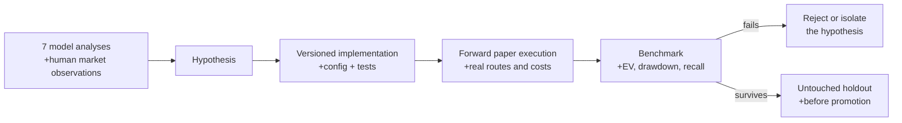
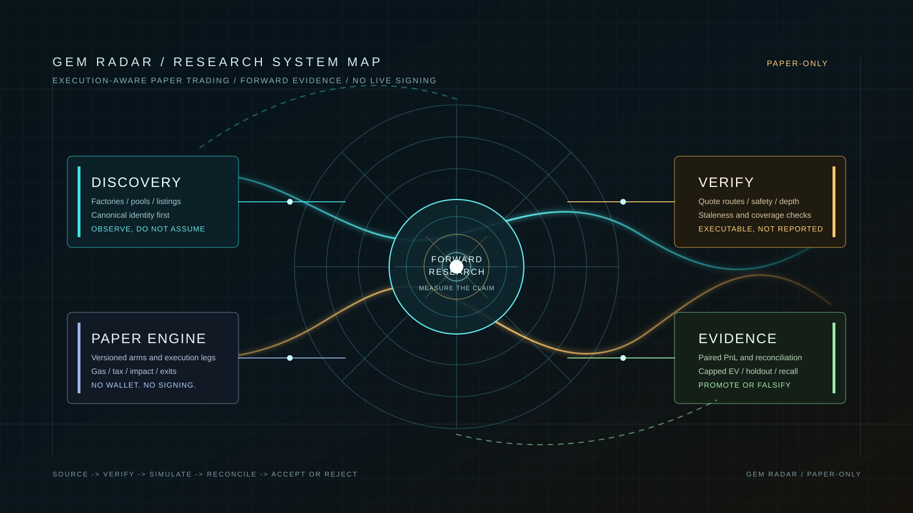

# Gem Radar

**A paper-only market research system for discovering, measuring, and replaying early DEX liquidity events.**

Gem Radar is not a trading bot with a buy button. It is an execution-aware research stack for asking a narrower, harder question:

> Given a real route, real pool state, modeled costs, and bounded latency, did a signal have positive executable expectancy?

The project watches EVM liquidity and swaps, evaluates protocol and contract risk, records immutable paper fills, and produces a reproducible evidence trail. It is designed to reject attractive chart narratives that cannot survive an executable sell quote.

## Status

| Property | State |
| --- | --- |
| Execution | **Paper-only** |
| Private keys / wallet signing | **Absent by design** |
| Primary runtime | Ethereum + Robinhood Chain |
| Persistence | PostgreSQL + Redis + append-only research logs |
| Current focus | Executable liquidity, creator risk, flow, and exit-policy research |
| Alpha claim | **None** - all strategies require forward validation |

> [!WARNING]
> This repository does not implement live execution and must not be treated as financial advice. A chart reaching `2x` is not considered a win unless the system could model a real executable exit after costs.

---

## Origin: An AI-Driven Development Experiment

Gem Radar began as a collaboration experiment: **could one human researcher and seven leading LLM analyses build a falsifiable research system for early-token trading?**

The models supplied hypotheses, implementation approaches, reviews, and alternative explanations. The human supplied market context, adversarial examples, operating constraints, and the willingness to reject a pleasant story when the logs disagreed. The database and forward paper record are the final arbiters.

The original model names and prompts were not preserved as versioned research inputs, so this repository does not assign performance credit to any individual model. That omission is intentional to acknowledge rather than conceal: consensus from several models is still not empirical evidence.



The experiment changed its own standard of success. The first question was, "Can we find 100x gems?" The current question is, "Can a frozen, chain-specific paper strategy show positive executable expectancy after costs, without relying on one outlier?"

---

## Research Flight Record

The table is deliberately a record of outcomes, not a roadmap of promises. Figures below are historical diagnostics from the archived research period; they are not current live performance and must not be pooled across different strategy versions.

| Era | Networks and venues | Hypothesis | What the record showed | Decision |
| --- | --- | --- | --- | --- |
| **M1/M2A: contract-first** | Ethereum, Base; GeckoTerminal, DexScreener | Contract safety, reported liquidity, age, and FDV can form a profitable early-token funnel. | In the 27 Jun-6 Jul slice: 82 entries, 76 exits, 69 outcomes labelled `RUG`, 4 `UNSELLABLE`; reported expectancy was about `-0.994` per dollar. | Security checks retained; alpha claim rejected. |
| **M2B-M5: score-first** | Ethereum, Base; Uniswap and Aerodrome liquidity reads | On-chain liquidity plus a composite score can rank future `2x` outcomes. | Score bands were not monotonic; candidates were not better than watchlist. A clean contract did not predict demand. | Score demoted to observational feature. |
| **Coverage expansion** | Ethereum, Base; direct factories plus aggregators | More feeds and faster discovery will recover winners. | Coverage improved, but more listings did not create precision. API listings could arrive after the relevant move. | Factory events retained; aggregator data treated as enrichment. |
| **Fixed survival confirmation** | Ethereum, Base | Waiting about 10 minutes would remove early rugs. | It often removed the early move instead. The delay was incompatible with short-lived launch dynamics. | Rejected as a primary entry policy. |
| **Four.meme launch flow** | BNB Chain; Four.meme | Direct launch events plus early independent-buy flow can outperform aggregator discovery. | Event decoding and state recovery improved, but executable `2x` precision was insufficient for promotion. | Kept as an isolated paper experiment. |
| **Robinhood stages** | Robinhood Chain; aggregator discovery and EVM liquidity checks | Chain-specific bootstrap and mature lanes improve recall without reusing ETH/Base gates. | Throughput and lifecycle coverage improved; the replay demonstrated routing change, not a proven edge. | Retained as discovery/research infrastructure. |
| **EVM Flow v1/v2** | Ethereum, Base, Robinhood; direct swaps and factory watches | Recent on-chain buy flow beats static features. | Base data quality and RPC lag initially prevented valid evaluation; ETH trigger sample was too small. | Frozen as a forward experiment, not tuned from noise. |
| **Solana multi-launch flow** | Solana; Raydium LaunchLab, Pump/PumpSwap, Meteora | Program-level launch events and protocol quotes can support paired entry experiments. | Attribution, quote coverage, and exit timeliness were incomplete. The result measured infrastructure failure more than alpha. | Isolated from the main runtime pending data-plane repair. |
| **Robinhood low-friction `2x`** | Robinhood Chain; executable V2/V3/V4 routes | Pools where a `$20` buy **and** sell both show very low impact may form a better execution regime. | The strongest archived slice was roughly 45 executable `2x` events in 92 low-friction observations, with reported EV around `+$3.2` to `+$3.6` per signal. Its bootstrap interval crossed zero. | Best hypothesis so far; **not** a proven edge. Requires a frozen forward sample and holdout. |
| **Creator / liquidity / trajectory safety** | Primarily Robinhood; exact route and exit evidence | Smaller probes and creator-aware state can preserve upside while limiting full-size collapses. | The work improved attribution and loss explanation; it has not yet proved a lower rug rate without sacrificing winners. | Remains paper-only instrumentation. |

### What the project learned

```text
contract safety is necessary for sellability, not sufficient for alpha
liquidity on an aggregator is not executable depth
more discovery sources improve recall, not precision by themselves
a fixed wait can turn confirmation into late entry
one large winner can counterfeit a profitable-looking backtest
chain microstructure matters more than a universal token score
```

---

## Network and Venue Matrix

| Network | Runtime role | Discovery and venue coverage | Research conclusion so far |
| --- | --- | --- | --- |
| **Ethereum** | Main runtime | GeckoTerminal, DexScreener, canonical factory events, Uniswap V2/V3/V4 quote paths | Active collection and paper evaluation; legacy selection results were weak. |
| **Robinhood Chain** | Main research focus | GeckoTerminal, DexScreener, canonical EVM factory watches, executable V2/V3/V4 routes | Best historical execution-regime hypothesis, but no validated out-of-sample alpha. |
| **Base** | Historical / optional research | GeckoTerminal, DexScreener, Uniswap V2/V3/V4, Aerodrome support | Early results were poor and public-RPC coverage was unreliable; not enabled by the normal launcher. |
| **BNB Chain** | Isolated experiment | Four.meme `TokenManager` events and protocol state | Direct-launch paper experiment; insufficient precision to promote. |
| **Solana** | Isolated experiment | Raydium LaunchLab, Pump, PumpSwap, Meteora DBC/DAMM adapters | Broad venue coverage in code, but measurement correctness must precede strategy claims. |

Third-party APIs are used for discovery and enrichment. Pool identity, executable route availability, and outcome accounting remain on-chain or protocol-derived checks wherever available.

---

## Research Principle

Most new-token systems fail because they confuse observable price with realizable value. Gem Radar treats the following as separate facts:

```text
reported liquidity != executable depth
spot price         != executable sell quote
contract clean     != positive expectancy
historical winner  != forward alpha
```

Every strategy is versioned. A new threshold, safety rule, fill model, or exit policy is a new experiment; historical records are preserved rather than rewritten to make a later idea look better.

---

## System Topology



```text
                    +------------------------------+
                    |  Discovery Plane             |
                    |  factories / Gecko / Dex     |
                    +--------------+---------------+
                                   |
                                   v
                    +------------------------------+
                    |  Verification Plane          |
                    |  bytecode / risk / quotes    |
                    |  V2 / V3 / V4 liquidity      |
                    +--------------+---------------+
                                   |
                    +--------------+---------------+
                    |                              |
                    v                              v
        +-------------------------+    +--------------------------+
        | Flow & Experiment Plane |    | Observation / Shadow     |
        | watches, swaps, arms,   |    | false negatives, recall, |
        | sequential paper fills  |    | data-quality cohorts     |
        +------------+------------+    +-------------+------------+
                     |                               |
                     +---------------+---------------+
                                     |
                                     v
                    +------------------------------+
                    | Evidence Plane               |
                    | PostgreSQL + CSV / JSONL     |
                    | benchmarks + reconciliation  |
                    +------------------------------+
```

### Core subsystems

| Subsystem | Responsibility |
| --- | --- |
| **Collectors** | Poll public discovery APIs and normalize candidate pools without treating their data as ground truth. |
| **Factory discovery** | Detects canonical EVM pool events before third-party listings where RPC coverage permits. |
| **On-chain verification** | Simulates executable V2/V3/V4 quotes, estimates depth and validates routes. |
| **Risk engine** | Records contract and sellability evidence; hard failures are distinct from missing provider data. |
| **Deployer reputation** | Tracks repeat, attributable creator behavior and supports persistent wallet blocklists. |
| **EVM flow watcher** | Tracks heads, swaps, watches, health, data coverage, and experiment timing. |
| **Paper engine** | Opens versioned simulated legs, evaluates exits, and records terminal explanations. |
| **Reporting** | Produces CSV journals and research benchmarks from the canonical database record. |

---

## What Makes a Paper Fill Valid

A position is not opened merely because a pool looks liquid on an aggregator. A benchmark-eligible fill requires a coherent chain of evidence:

```text
canonical pool identity
  -> fresh, healthy data plane
  -> executable buy route
  -> executable sell route
  -> modeled fees, gas, taxes, and impact
  -> versioned strategy decision
  -> idempotent execution leg
  -> executable exit or terminal mark
```

The quote model stores both side-specific impact and round-trip friction. A route failure, stale quote, or incomplete coverage is evidence about the sample; it is never converted into a favorable synthetic fill.

### Exit taxonomy

Losses are deliberately classified instead of being collapsed into a generic `RUG` label:

| Outcome family | Meaning |
| --- | --- |
| `LADDER_SELL` | A configured profit leg was executable. |
| `HARD_STOP_SELL` | Executable value crossed the hard-stop threshold. |
| `CREATOR_EXIT_SELL` | Attributable creator-risk protection closed the position. |
| `DEPTH_COLLAPSE_SELL` | Executable depth collapsed across confirmation reads. |
| `LIQUIDITY_GONE_SELL` | Near-zero liquidity was confirmed, not inferred from one failed quote. |
| `UNSELLABLE_EXIT` | The sell simulation or route was persistently unavailable. |
| `TIME_LOSS` / `PARTIAL_PROFIT` | The configured horizon expired with a realized executable value. |

This distinction matters: a V3 range moving out of active liquidity, a broken quote route, and a proven liquidity removal are different market events and must not be benchmarked as the same thing.

---

## Strategy Discipline

Gem Radar supports several research lanes, but it does not silently merge them into one win rate.

- **Primary and shadow cohorts are separate.** Shadow observations preserve recall and false-negative evidence without polluting the primary book.
- **A pool is one market sample.** Parallel entry or exit arms are paired counterfactuals, not independent wins.
- **Score is observational.** It may be reported, but it is not evidence that a token will reach `2x`.
- **Results are execution-aware.** PnL includes entry/add legs, partial exits, gas, modeled friction, residual value, and failed transaction cost.
- **Promotion requires forward data.** Raw PnL alone is insufficient; capped EV, top-winner-excluded PnL, drawdown, and data health must agree.

The practical objective is not to find the largest historical multiple. It is to identify a repeatable cohort whose **net expectancy remains positive after costs and without dependence on one outlier**.

---

## Runtime Layout

```text
gem-radar/
  src/
    collector/       API discovery, normalization, stage gates
    onchain/         AMM quotes, liquidity verification, factory events
    flow/            EVM watches, swaps, experiments, health
    risk-engine/     contract and sellability analysis
    deployer/        creator history and persistent blocklists
    paper/           entries, legs, exits, evaluation, accounting
    file-logger/     append-only CSV and JSONL journals
    report/          daily research outputs
    solana/          isolated Solana research runtime (not main default)
    sniper/          isolated Four.meme/BSC paper experiment
  prisma/            canonical schema and migrations
  scripts/           benchmarks, diagnostics, probes, reports
  logs/              local operational and research artifacts (ignored)
```

The normal desktop launcher starts only the Ethereum/Robinhood main runtime. Solana and the BSC launch experiment are intentionally isolated entrypoints so one research lane cannot duplicate another lane's ingestion.

---

## Quick Start

### Requirements

- Node.js 20 or newer
- Docker Desktop with the Linux engine running
- An EVM RPC endpoint for each enabled chain

### Windows launcher

```bat
dev.bat
```

The launcher starts PostgreSQL and Redis through Docker Compose, applies existing migrations, and opens the Ethereum/Robinhood collector. It does not start Solana.

### Manual setup

```bash
copy .env.example .env
npm install
docker compose up -d --wait
npm run db:migrate:deploy
npm run db:generate
npm run start:dev
```

For a compiled process:

```bash
npm run build
npm run start:prod
```

Never commit `.env`, `logs/`, local Docker volumes, or API keys.

---

## Configuration Surface

The complete, documented configuration template is [`.env.example`](.env.example). The usual starting surface is:

```dotenv
COLLECTOR_CHAINS=ethereum,robinhood
EVM_FLOW_CHAINS=ethereum,robinhood

ETHEREUM_RPC_URL=https://your-ethereum-rpc
ROBINHOOD_RPC_URL=https://rpc.mainnet.chain.robinhood.com

COLLECTOR_POLL_INTERVAL_MS=30000
FACTORY_DISCOVERY_ENABLED=true
EVM_FLOW_ENABLED=true
PAPER_EVAL_AUTOSTART=true
```

RPC endpoints are operational dependencies, not a source of alpha. When a provider is rate-limited or a stream is unhealthy, Gem Radar records degraded coverage and routes the affected sample to research rather than inventing a timely fill.

---

## Data Contract

PostgreSQL is the canonical store. CSV and JSONL are operator-friendly exports, not competing sources of truth.

| Artifact | Purpose |
| --- | --- |
| `logs/decisions/paper_entries.csv` | One row per simulated entry or add execution leg. |
| `logs/decisions/paper_exits.csv` | One row per realized exit leg with reason and execution context. |
| `logs/decisions/position_ticks.csv` | Periodic open-position valuation and evaluation diagnostics. |
| `logs/raw/source_payloads.jsonl` | Compact collection-cycle source summaries. |
| `logs/raw/contract_risk_checks.csv` | Risk-provider and contract-check evidence. |
| `logs/reports/` | Human-readable daily and benchmark reports. |

File timestamps are recorded in `Europe/Warsaw` with an explicit UTC offset, for example `2026-08-04T16:45:17.592+02:00`. Database timestamps remain UTC to keep ordering and cross-runtime semantics stable.

### Retention model

- Immutable decisions, signals, paper positions, execution legs, and outcome summaries are retained for research continuity.
- Raw high-frequency observations are operational data and can be archived after the configured hot-retention period.
- Historical rows are never recomputed under a new strategy version.

---

## Benchmarks

The project favors defensible comparisons over a single attractive PnL number.

```bash
npm run benchmark
npm run benchmark:flow
npm run benchmark:robinhood-entry
npm run benchmark:robinhood-ablation
npm run diagnostics:score
npm run edge
```

When evaluating a strategy, inspect at least:

1. net EV per original signal;
2. EV capped at `10x`;
3. PnL without the top one and top three winners;
4. median PnL, profit factor, and maximum drawdown;
5. executable `2x` precision and recall;
6. rug, sellability, and missing-data rates;
7. latency, RPC coverage, and quote age.

A strategy that only wins because of one exceptional token, a favorable stale quote, or a mixed cohort has not earned promotion.

---

## Operations

### Health signals

The EVM flow health line reports:

```text
head / lag / watched pools / swap observations / signals / open positions
RPC failures / coverage / unresolved ranges / queue state / process memory
```

Useful operational checks:

```powershell
# Latest decision activity
Get-Content logs\decisions\paper_entries.csv -Tail 10
Get-Content logs\decisions\paper_exits.csv -Tail 10
Get-Content logs\decisions\position_ticks.csv -Tail 10

# Full test suite
npm test -- --runInBand

# Local service port
netstat -ano | findstr :3000
```

The HTTP port is a local runtime surface, not a public trading API. Do not expose it to the Internet without adding an explicit security boundary.

### Common scripts

| Command | Use |
| --- | --- |
| `npm run build` | Compile TypeScript to `dist/`. |
| `npm run start:dev` | Run the main collector with hot reload. |
| `npm run start:prod` | Run the compiled main collector. |
| `npm run start:solana` | Run the isolated Solana paper-research runtime. |
| `npm run start:sniper` | Run the isolated Four.meme/BSC paper experiment. |
| `npm test` | Run all automated tests. |
| `npm run report:now` | Generate the current report. |
| `npm run deployers:refresh` | Refresh deployer-reputation research data. |
| `npm run deployers:block -- <chain> <address> <reason>` | Add a persistent creator blocklist entry. |

---

## Safety Boundary

Gem Radar intentionally has no:

- private-key configuration;
- wallet client;
- transaction signing;
- transaction broadcasting;
- automatic live execution path.

That boundary is architectural, not a UI toggle. A future live executor would need to be a separately reviewed component consuming durable, idempotent signals; it is not part of this repository's normal runtime.

---

## Contributing

Research changes should be narrow and auditable:

1. Do not rewrite historical outcomes.
2. Give every material strategy or threshold change a new version/config hash.
3. Keep primary, shadow, and control cohorts separate.
4. Add a focused test for changed execution or accounting behavior.
5. Run the full test suite before claiming an operational improvement.
6. Never claim alpha from an in-sample result or raw PnL alone.

## License

No license has been published for this repository. Treat the source as proprietary unless the repository owner adds an explicit license file.
