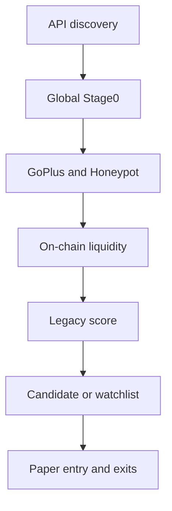
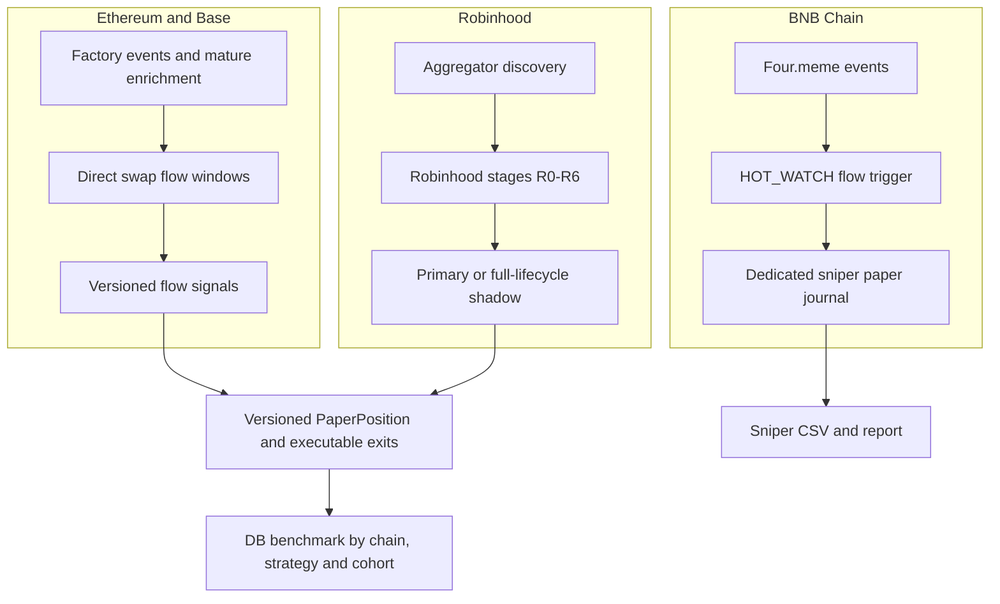

# Gem Radar: технічна хронологія дослідження

**Період:** від початкового синтезу семи LLM-аналізів до 2026-07-20  
**Статус системи:** research та paper trading; production/live execution заборонені  
**Ролі:** користувач формує ринкові гіпотези, знаходить контрприклади й оцінює поведінку токенів; coding agent проєктує, реалізує, тестує та вимірює систему

## 1. Короткий висновок

Gem Radar почався як спроба зібрати спільну стратегію з ідей семи LLM-моделей: знаходити дуже ранні токени, відкидати очевидні scams і залишати невелику кількість кандидатів з асиметричним upside. Початкова архітектура була логічною для security scanner, але не для alpha engine: API discovery передавав токен у статичні фільтри контракту, on-chain liquidity, score та paper trading. Ми неявно припустили, що безпечніший контракт і вищий score означають більшу ймовірність 2x.

Логи це припущення не підтвердили. Контрактні перевірки знаходили реальні ризики, але майже не ранжували майбутній попит. Вищий score не відділяв winners від rugs, API listings часто приходили після основного руху, а однакова логіка поводилася по-різному на Ethereum, Base і Robinhood. Додавання джерел збільшувало кількість токенів, але не створювало edge.

Головний результат пройденого шляху не в тому, що знайдено готового прибуткового бота. Результат у тому, що система перейшла від нечіткої задачі “знайти x1000 gem” до перевірюваних, versioned гіпотез:

1. Чи дає ранній незалежний buy flow кращу ймовірність executable 2x?
2. Які hard safety gates справді захищають від неможливості продати, а які лише зменшують recall?
3. Які правила мають бути chain-specific?
4. Яка expectancy після gas, slippage, taxes, failed sells і terminal exits?

Поточна система значно сильніша як дослідницька платформа, але edge ще не доведений. Legacy ETH/Base результати слабкі, BSC sniper має недостатню 2x precision, Robinhood показав кращий режим, але деградував у пізнішому walk-forward періоді, а новий ETH/Base flow engine має лише два унікальні triggered pools.

## 2. Походження: синтез семи LLM-моделей

До першого коміту була концептуальна фаза: сім LLM-моделей запропонували ідеї щодо discovery, contract safety, liquidity, scoring, paper trading і пошуку ранніх gems. Ми зібрали ці поради в одну послідовну pipeline-архітектуру.

Це дало хороший широкий checklist, але мало фундаментальний недолік: консенсус LLM не є емпіричною валідацією. Різні моделі могли повторювати однакові популярні Web3 евристики: LP lock, renounced ownership, низький FDV, “safe” contract, social activity, holder concentration. Об'єднання семи відповідей збільшило впевненість у списку features, але не довело, що будь-яка з них передбачає executable 2x.

Імена моделей, prompts і початкові відповіді не збережені в репозиторії. Для відтворюваності наступних research-ітерацій такі матеріали треба зберігати як dated research inputs, окремо від коду та результатів.

## 3. Як змінювалася ціль

| Етап | Формулювання цілі | Чому воно змінилося |
|---|---|---|
| Початок | Знайти gem, потенційно x100-x1000 | Надто рідкісна подія, слабка статистична перевірюваність |
| Contract-first | Відсіяти scams і залишити “якісні” токени | “Безпечний контракт” не означав позитивний market outcome |
| Score-first | Ранжувати survivors і брати candidates | Score bands не були монотонними за результатом |
| Throughput | Додати джерела та мережі, щоб не пропускати winners | Більше discovery не покращило precision саме по собі |
| Exit-first | Взяти 2x, залишивши runner на великий gem | Потребувало executable exits, а не chart high-water marks |
| Flow-first | Входити за раннім підтвердженим попитом | Це пряміше пов'язано з короткостроковим price expansion |
| Поточна | Довести позитивну expectancy versioned paper-стратегії | Це вимірювана умова перед будь-яким live execution |

## 4. Хронологія поколінь

| Період | Покоління | Основна гіпотеза | Що змусило рухатися далі |
|---|---|---|---|
| До 28.06 | Синтез 7 LLM | Сума популярних евристик дасть якісний gem funnel | Консенсус ідей не мав empirical validation |
| 28.06 | M1/M2A contract-first | Contract safety та Stage0 приберуть більшість поганих outcomes | Safe contract не передбачав 2x, reported gates створили misses |
| 28.06-03.07 | M2B-M5 score-first | On-chain liquidity і score відділять winners | Score bands не були монотонними, paper expectancy була негативною |
| 04.07-06.07 | Data quality/reputation | Кращий GoPlus parsing і deployer history зменшать serial rugs | Provider coverage лишалася partial, identity rules потребували масштабування |
| 07.07-09.07 | Multi-source discovery | Більше feeds поверне пропущені gems | Coverage виріс, але latency та precision не стали достатніми |
| 10.07-11.07 | Robinhood experiment | Новий hype regime матиме кращу асиметрію | Глобальні safety/rug правила не відповідали chain microstructure |
| 13.07 | Factory + confirmation | Direct discovery плюс 10m survival check зменшать rugs | Fixed delay знищував early-entry edge |
| 16.07-19.07 | Four.meme sniper | Launchpad events дадуть сигнал раніше aggregators | Event decoding виправлено, але 2x precision лишилася низькою |
| 19.07-20.07 | Flow v1 + Robinhood stages | Independent buy flow і chain-specific routing кращі за static score | Гіпотези тепер чекають frozen forward samples |

### Phase 0. Multi-model design, до 2026-06-28

**Гіпотеза.** Якщо поєднати discovery, contract checks, liquidity verification, scoring і paper exits, можна відфільтрувати більшість сміття та залишити gems.

**Архітектурна ідея.** Послідовний funnel, де кожен наступний модуль дорожчий і працює з меншою кількістю токенів.

```text
Public listings -> cheap filters -> contract safety -> liquidity -> score -> paper trade
```

**Що було правильним.** Paper-only режим, fail-safe safety, журналювання рішень, поступове збільшення вартості перевірок.

**Що було слабким.** Ми змішали три різні задачі в один score: scam prevention, market quality та alpha prediction. Вони корелюють не обов'язково і мають різні false-positive costs.

### Phase 1. M1/M2A contract-first radar, 2026-06-28

Перший коміт `af3e0e2` створив NestJS/Prisma pipeline для Ethereum і Base:

```text
GeckoTerminal + DexScreener
            |
            v
Stage0: quote / age / reported liquidity / FDV
            |
            v
GoPlus + Honeypot.is
            |
            +--> CONTRACT_REJECT
            +--> CONTRACT_UNKNOWN -> quarantine/research
            +--> CONTRACT_SAFE -> persistence
```

**Мета.** Спочатку не купувати, а навчитися стабільно збирати та класифікувати нові пули.

**Сильні сторони.** Чіткі `CONTRACT_SAFE`, `CONTRACT_REJECT`, `CONTRACT_UNKNOWN`; fail-safe parsing; накопичення всіх reject reasons; відсутність private keys.

**Проблема.** Reported liquidity і pool age використовувалися як ранні hard gates. Це було дешево, але створювало blind spot: токен міг бути молодим on-chain, перевипущеним у новому пулі або вже рухатися до того, як aggregator оновив listing.

### Phase 2. M2B-M5: on-chain liquidity, score, paper lifecycle, 2026-06-28 - 2026-07-03

До funnel додали V2/V3 liquidity verification, slippage, чисту `scoreSnapshot()`, paper entries, paper exits, edge analysis, postmortem, gem shadow tracking і deployer reputation. Коміт `aafa939` формалізував shadow tracking та reputation gate.

```text
CONTRACT_SAFE
      |
      v
on-chain TVL + executable depth
      |
      v
legacy score: liquidity / depth / age / traction / divergence
      |
      v
watchlist / candidate / high
      |
      v
paper entry -> ladder / rug / unsellable / time outcome
```

**Правильне рішення.** `scoreSnapshot()` був pure function, а confidence враховував неімплементовані компоненти. Система не фабрикувала повну впевненість.

**Неправильне рішення.** Score почав фактично виконувати роль buy signal до того, як було показано, що він ранжує 2x outcomes. Це перетворило охайну інженерну модель на недоведену trading policy.

**Ранній емпіричний сигнал.** У зрізі 27.06-06.07 було 82 paper entries і 76 exits; 69 були класифіковані як RUG, 4 як UNSELLABLE, а стара оцінка expectancy була близькою до повної втрати одиниці капіталу. Candidate band не був кращим за watchlist. SPEPE став важливим позитивним винятком, де ladder дозволив зафіксувати 2x і дати частині позиції дійти вище 5x.

**Висновок.** Pipeline працював технічно, але не довів market edge.

### Phase 3. Data quality, GoPlus і serial deployers, 2026-07-04 - 2026-07-06

Коміти `e5778b5` і `22a04bf` виправляли GoPlus parsing, strict restrictions, partial responses та deployer blocking. З'явився системний кейс `openhuman`: один і той самий серійний creator/deployer запускав повторні токени, які проходили контрактний funnel.

**Моя перша помилка.** Я запропонував одиничний deployer у `.env`, а в окремий момент також ticker blacklist. Для загальної проблеми serial rugger це слабка архітектура:

- `.env` не є audit-friendly registry;
- одна адреса не масштабується на нових deployers;
- ticker є властивістю branding, а не identity;
- блокування ticker може відкинути незалежний легітимний контракт з такою самою назвою.

**Твоя правильна корекція.** Загальне правило має блокувати wallet/deployer identity і накопичувати reputation. Ticker block допустимий лише як вузький, свідомий виняток для повторюваного `openhuman`, а не як основний anti-rug механізм.

**Що реалізовано.** Deployer reputation, wallet-based blocklists, repeat-rug statistics, окремі config registries та CLI для блокування deployer-а.

**Ще одна важлива знахідка.** GoPlus partial/unavailable був не лише багом коду. Для дуже свіжих токенів provider часто фізично не має повних tax/owner fields. Отже, provider availability не можна плутати з contract safety чи market quality.

### Phase 4. Більше discovery та контрфактичний аудит, 2026-07-07 - 2026-07-09

Коміт `68d987f` додав Moralis і Birdeye; DexScreener discovery розширився profiles, boosts, community takeovers та ads. Паралельно були виправлені bigint conversion, deprecated Moralis endpoints, V2/V3 physicality checks, GeckoTerminal pacing і 429 backoff (`c8bc095`, `338fc5d`).

**Гіпотеза.** Можливо, погані результати спричинені не entry logic, а недостатнім coverage.

**Твоя важлива поправка щодо gainers.** DexScreener gainers не мали стати джерелом входу. Їхня роль була контрфактична: знайти токени, які вже дали великий рух, і перевірити, де саме pipeline їх пропустив. Це привело до кейсів STRAT, SKILL, SYNC, SWING та інших.

**Що вони показали.** Причини пропусків були різні:

- aggregator discovery прийшов запізно;
- `pool_too_old` оцінював listing/pool timestamp не так, як вимагала гіпотеза;
- reported та on-chain liquidity радикально розходилися;
- entry відбувався біля локального high, хоча 24h chart показував великий gain від набагато нижчої бази;
- token міг не мати social/profile metadata, але це не мало бути gate.

**Моя помилка.** Спочатку я інтерпретував перелік gainers майже як пропозицію додати їх у discovery. Ти правильно уточнив, що ціль полягає в знаходженні до появи в gainers.

**Методологічне обмеження.** Ручний список великих winners має survivorship bias. Він добре знаходить false negatives, але не оцінює precision, бо не містить тисяч токенів, що виглядали так само на старті й померли.

### Phase 5. Robinhood як окремий market regime, 2026-07-10 - 2026-07-11

Коміт `4185cdd` додав Robinhood chain, V4 probing, experimental static safety та paper lifecycle; `e97d61f` додав experimental on-chain TVL floor `$200`; `944679c` ввів chain-specific підтвердження низької ліквідності.

**Чому мережа була цікава.** Новий EVM-compatible chain мав коротке hype window, RWA/xStocks narrative і несподівано велику кількість meme launches. Ранній режим Robinhood помітно відрізнявся від Base/Ethereum.

**Проблема provider coverage.** GoPlus/Honeypot не підтримували Robinhood. Ми створили temporary safety contract:

- executable on-chain quote;
- minimum depth;
- minimum on-chain TVL;
- bytecode/static checks;
- paper-only execution.

**Проблема exit classification.** На Robinhood transient liquidity snapshots іноді давали близько `0.9x` або короткий low-liquidity read, після чого той самий токен доходив до 2x. Глобальна Base/ETH rug policy закривала позицію завчасно.

**Твоя правильна корекція.** Це chain-specific microstructure, а не доказ, що rug threshold глобально неправильний. Robinhood отримав додаткове підтвердження low-liquidity стану, тоді як Base/ETH зберегли швидшу реакцію.

**Слабке припущення з нашого боку.** TVL `$200` є research compromise, а не production safety level. Воно збільшує recall у молодому chain regime, але також допускає надзвичайно маніпульовані пули.

### Phase 6. Latency, factory discovery і помилкова 10-хвилинна confirmation policy, 2026-07-13

Коміт `8f147c8` додав direct factory discovery, V4 improvements, benchmarking CSV та `PENDING_CONFIRMATION` cohort.

**Гіпотеза.** Дочекатися 10 хвилин і перевірити, що liquidity/depth/price не зникли, щоб зменшити rugs.

**Чому це було неправильно.** Для дуже молодого meme token десять хвилин можуть охоплювати більшість доступного руху. Confirmation зменшував scam exposure, але купував уже після price expansion або drawdown. Для задачі раннього 2x це знищувало latency edge.

**Твоя правильна критика.** Unit tests підтверджували state transitions і відсутність програмних помилок, але не підтверджували trading readiness. Технічно тести роблять більше, ніж перевірка синтаксису, проте вони не можуть довести market hypothesis без replay/forward outcomes.

**Архітектурний урок.** Safety confirmation не повинна бути фіксованою затримкою. Entry має відбуватися одразу після event-driven trigger, а safety повинна перевіряти executable state у тому самому часовому контексті.

### Phase 7. Four.meme/BSC launch sniper, 2026-07-16 - 2026-07-19

Після аналізу open-source sniper repositories ми не копіювали їх напряму. Частина репозиторіїв не містила заявленої стратегії, а Solana-проєкт включав volume-generation і wallet-distribution механізми поза межами безпечного research. Корисний патерн був інший: прямий launchpad event stream замість пізнього aggregator listing.

Коміт `5671ca9` додав окремий `sniper-main.ts`, Four.meme/BSC watcher, paper engine і journal; `756a0ad` виправив API seeding та event decoding; `824accc` додав creator exits і CSV exports.

```text
Four.meme TokenManager events
          |
          v
official factory provenance
          |
          v
HOT_WATCH: buyers / blocks / buy flow / concentration / momentum
          |
          v
paper entry -> ladder / creator exit / stop / time exit
```

**Мої помилки під час інтеграції.**

- Перший watcher читав блоки, але не знаходив launches через неповне розуміння event/API flow.
- `watching=0`, `open=0` не пояснювали, чи немає launch events, чи trigger завузький.
- Після виправлень `watching=0`, `open=1` виглядало як порушення логіки, хоча watch означав active pre-entry window, а open означав уже відкриту position. Семантика health log була недостатньо ясною.
- Додавання sniper-а поруч із legacy runtime спочатку створило operational confusion: який процес запускає яку стратегію, де health logs і де journals.
- JSON/NDJSON був зручний для durability, але незручний для ручного аналізу; CSV mirror додали пізніше.

**Твоя правильна вимога.** Sniper мав бути окремим headless paper-only process без HTTP port, wallet client чи впливу на legacy collector.

**Поточний результат.** Станом на 2026-07-20 Four.meme report мав 34 entries, 33 closed, 2 випадки 2x, `precision_2x=5.88%`, average realized multiple `1.0301`. Із закриттів 23 спричинив `CREATOR_EXIT`. Це ще не доведений edge; позитивна середня оцінка тримається на малій вибірці та конкретному exit model.

### Phase 8. ETH/Base Flow Strategy v1 і Robinhood Stages v1, 2026-07-19 - 2026-07-20

Legacy benchmark показав, що static score не виконує головної задачі. Ми змінили предмет оптимізації: не “безпечний token score”, а ранній незалежний buy flow.

**ETH/Base Flow Strategy v1.**

- direct factory discovery;
- polling/block tracking незалежно від повільного collector cycle;
- V2/V3/V4/Aerodrome swap decoding;
- `tx.from`/trader identity замість router address;
- rolling windows 30s, 60s, 120s і 5m;
- unique buyers, buy/sell quote, concentration, momentum, distinct blocks, creator sell;
- чотири frozen strategies: `fresh_early_v1`, `fresh_confirmed_v1`, `mature_early_v1`, `mature_confirmed_v1`;
- `StrategySignal`, strategy version, risk cohort, idempotency, reorg/late exclusions;
- canonical DB benchmark з paired comparison.

**Robinhood Stages v1.** Robinhood більше не використовує глобальні ETH/Base liquidity/FDV правила. Окремі stages `R0-R6` розділяють identity, age, bootstrap activity, provider state, executable liquidity, score routing і static safety. Score `>=50` іде в primary, `30-49.99` у full-lifecycle shadow з окремим `strategyVersion`.

**Replay Robinhood stages.** Із 937 унікальних старих rejected token/pool новий discovery пропустив би 208 до on-chain перевірки, але 689 тихих bootstrap clones залишив би rejected. Серед 148 унікальних старих paper-gate evaluations 45 score-only rejects тепер отримали б shadow lifecycle.

**Поточний ETH/Base flow benchmark.** Є лише 2 унікальні triggered Ethereum pools і 0 Base triggers. Показник `50% precision2x` на двох samples статистично нічого не доводить. Frozen v1 thresholds не можна змінювати до 100 triggered pools на кожній мережі.

## 5. Архітектурна еволюція

### Початкова архітектура: один funnel



Проблема цієї форми: global Stage0, contract safety і score послідовно зменшували recall, але жоден модуль не вимірював поточний buy demand. Funnel був добре пристосований до класифікації контрактів і погано пристосований до latency-sensitive entry.

### Поточна архітектура: окремі experimental lanes



Це все ще transitional architecture. Legacy CSV, canonical DB flow benchmark і separate sniper journal співіснують. Для production-quality research бажано мати єдину event/outcome store, але старі CSV не слід видаляти: вони потрібні як audit trail і regression baseline.

## 6. Що coding agent робив неправильно

| Помилка | Наслідок | Виправлення або урок |
|---|---|---|
| Прийняв contract safety за proxy для alpha | Safe-looking tokens усе одно rug/decline; gems відкидалися | Hard safety відділено від flow signal і soft features |
| Використовував legacy score як entry decision без validation | Candidate не був стабільно кращим за watchlist | Score залишено як legacy feature; flow strategies versioned окремо |
| Застосував global thresholds до різних chains | Robinhood bootstrap regime масово втрачався | Chain-specific Robinhood stages і rug confirmation |
| Запропонував 10-хвилинний `PENDING_CONFIRMATION` | Entry після основного руху, latency edge втрачено | Event-driven immediate trigger плюс same-time executable preflight |
| Запропонував 50% sell на 2x | Gross повертав лише initial stake, не створюючи достатньої фіксації прибутку | Користувач задав 80% на 2x; runners відокремлені |
| Почав із одиничного blacklist у `.env` і ticker logic | Не масштабувалося та могло блокувати незалежні токени | Wallet/deployer identity, reputation DB, config registries; ticker лише вузький виняток |
| Дозволив `research_paper_entries` без симетричних exits | Дані не відповідали на питання outcome | Full-lifecycle shadow positions і explicit benchmark eligibility |
| Створив забагато CSV без достатнього автоматичного synthesis | Користувач мусив вручну аналізувати тисячі рядків | Aggregated benchmarks, canonical DB для flow, strategy/cohort dimensions |
| Покладався на aggregators як на clock | Пізнє discovery та rate limits | Factory/launchpad events і direct swaps; APIs лише enrichment |
| Недооцінив GeckoTerminal/Moralis/GoPlus limits | 429, 401, provider outages і data gaps | Shared backoff, pacing, circuit breakers, API-independent core timing |
| Неправильно або неповно інтегрував Four.meme на першій спробі | Blocks рухалися, але launches/open positions були нульовими | API seeding, corrected decoding, health semantics, creator exits |
| Змішав runtime modes під час sniper integration | Legacy міг не запускатися, port 3000 конфліктував, logs були неочевидні | Окремий `sniper-main`, process lock, no HTTP listener, окремий journal |
| Занадто швидко інтерпретував unit tests як “готовність” | Green tests могли створити хибне відчуття якості стратегії | Розділено code correctness, data quality і market validation |
| Реагував на окремі токени локальними patches | Ризик overfitting і rule accumulation | Frozen versioned strategies та minimum sample gates |

## 7. Які підказки користувача були сильними

1. **Не блокувати загальну назву замість identity.** Це змусило перейти до deployer wallets і reputation.
2. **Gainers є аудитом misses, а не entry feed.** Це правильно сформулювало latency objective.
3. **SKILL був знайдений надто пізно.** Великий 24h gain не означає, що наша entry отримала цей gain; потрібна ціна саме в момент сигналу.
4. **Paper entries без exits не мають дослідницької цінності.** Outcome lifecycle має бути симетричним.
5. **50% на 2x не є нормальною фіксацією прибутку для цієї мети.** Exit policy має відповідати risk preference.
6. **Robinhood має іншу liquidity dynamics.** Chain-specific evidence важливіший за глобальну чистоту правил.
7. **10 хвилин confirmation вбивають early-entry thesis.** Safety не повинна автоматично означати delay.
8. **Watchlist іноді кращий за candidates.** Це був прямий доказ, що score ordering не виконує задачу.
9. **Логи повинні пояснювати роботу процесу.** Health logs, CSV mirror і explicit states стали частиною correctness.
10. **Contract checks не гарантують market outcome.** LP lock, CEX listing чи safe bytecode не усувають economic rug і liquidity withdrawal.

## 8. Які підказки або припущення користувача були слабкими

Це не “помилки користувача” в побутовому сенсі, а дослідницькі гіпотези, які потребували жорсткішої перевірки.

| Припущення | Чому воно ризиковане | Коректніша форма |
|---|---|---|
| “Потрібно знаходити угоди, які точно дадуть 2x” | У permissionless markets немає детермінованого 2x signal | Максимізувати out-of-sample precision та позитивну expectancy |
| Великі DexScreener gainers доводять, що їх можна було купити рано | Hindsight не показує, чи сигнал існував до росту і чи був executable exit | Replay timestamped pre-move data з повним denominator |
| Більше chains/sources автоматично покращить результат | Збільшується throughput, API surface і noise, але не signal quality | Додавати lane лише з окремою версією та benchmark |
| Immediate entry завжди кращий | Зменшує latency, але максимізує exposure до launch manipulation | Immediate entry лише після мінімального event-driven demand + executable safety |
| GoPlus пропускає gems, тому його краще майже прибрати | Soft flags справді шкодять recall, але honeypot/cannot-sell залишаються критичними | Hard gates лише для доказової неможливості безпечного exit; інше у features/shadow |
| LP lock має означати безпечний token | Не захищає від mint, market dump, malicious token logic чи secondary liquidity collapse | LP lock лише feature, не outcome guarantee |
| `$200` Robinhood TVL достатньо | Це дуже маніпульований liquidity regime | Paper-only cohort, depth/quote checks і окреме вимірювання rug rate |
| Видалити старий проєкт і почати sniper з нуля | Втрачаються logger, paper engine, risk adapters, historical audit і tests | Зберегти інфраструктуру, але ізолювати strategy runtime та persistence boundaries |
| Часто міняти thresholds після кожного missed winner | Це прямий шлях до overfitting на anecdotes | Заморожувати version до наперед визначеного sample size |
| 80% на 2x “завжди гарантує плюс” | Лише якщо 2x є executable після gas, slippage, taxes і sell success | Trigger ladder за executable net multiple |

## 9. Спільні процесні помилки

### 9.1 Занадто швидка зміна задачі

Ми переходили від security scanner до gem finder, від ETH/Base до Robinhood, потім до BSC sniper, а далі назад до ETH/Base flow. Кожен поворот мав логічну причину, але strategy versions та acceptance criteria з'явилися пізно. Через це історичні CSV змішали різні policies.

### 9.2 Змішування safety, alpha та execution

- Safety відповідає: чи можна купити й продати без явної контрактної пастки?
- Alpha відповідає: чи є статистична перевага в напрямку ціни?
- Execution відповідає: чи збережеться перевага після реального fill model?

Початковий funnel намагався відповісти на всі три питання одним score. Поточна архітектура розділяє їх.

### 9.3 Anecdotes випереджали denominator

Ручні кейси були дуже корисні для знаходження bugs і false negatives. Але без усіх contemporaneous non-winners вони не можуть встановити threshold. Найкращий процес: anecdote створює нову feature hypothesis, а не негайне production rule.

### 9.4 Недостатня стабільність measurement contract

Змінювалися rug classification, exit ladder, time exits, gas assumptions, Robinhood confirmations і CSV schemas. Тому старі та нові outcomes не завжди порівнювані. `strategyVersion`, `riskCohort`, `exitPolicy` і `benchmarkEligible` були додані саме для усунення цієї проблеми.

## 10. Поточні результати станом на 2026-07-20

### Legacy CSV benchmark

| Chain | Paper entries | Positions with exit | Observed 2x |
|---|---:|---:|---:|
| Base | 254 | 250 | 3 |
| Ethereum | 93 | 87 | 5 |
| Robinhood | 285 | 283 | 75 |

Observed 2x означає зафіксований high-water mark у наявних логах, а не автоматично прибутковий executable trade. Пізніший walk-forward segment показав:

- Base: `2/48`, або 4.2%;
- Ethereum: `4/29`, або 13.8%;
- Robinhood: `11/73`, або 15.1%.

Robinhood train segment мав 34.2% 2x, але later segment лише 15.1%. Це важливий доказ regime drift і причина не оголошувати ранній успіх постійним edge.

### Four.meme sniper

- 34 entries;
- 33 closed;
- 2 hit 2x;
- 5.88% 2x precision;
- 23 creator exits;
- modeled average realized multiple 1.0301.

### ETH/Base flow v1

- Base: 0/100 required unique triggered pools;
- Ethereum: 2/100;
- будь-які precision/expectancy числа поки underpowered.

### Висновок з цифр

Legacy score-first strategy не продемонструвала достатній edge. Robinhood дав кращий hit rate, але нестабільний у часі. Sniper ще не має потрібної precision. Flow strategy є найбільш причинно обґрунтованою гіпотезою, але ще не має sample size.

## 11. Що фактично побудовано

За цей період проєкт виріс від базового collector-а до системи з 394 passing tests і такими компонентами:

- multi-source EVM discovery;
- factory and launchpad event discovery;
- GoPlus/Honeypot risk normalization і circuit breakers;
- V2/V3/V4/Aerodrome liquidity та executable quote models;
- token age, metadata, deployer reputation і blocklists;
- legacy scoring, watchlist, shadow cohorts;
- paper entries, ladders, stops, partial-profit/time exits і rug confirmations;
- Robinhood experimental safety та versioned stages;
- Four.meme paper sniper з durable state і CSV/NDJSON journals;
- ETH/Base rolling flow engine;
- canonical DB flow benchmark, CSV legacy benchmark, paired strategies, walk-forward summaries;
- explicit paper-only boundaries без wallet/private-key execution.

Це вже серйозна research infrastructure. Вона ще не є production trading system.

## 12. Як ми рухаємося до цілі тепер

```text
Market observation
      |
      v
Counterexample or failure class
      |
      v
Feature hypothesis, not an immediate threshold
      |
      v
Versioned strategy with frozen rules
      |
      v
Forward paper sample with executable fills
      |
      v
Walk-forward and holdout evaluation
      |
      +--> no edge: reject hypothesis
      |
      +--> stable positive expectancy: larger paper validation
      |
      +--> only then consider isolated live executor research
```

Найважливіша зміна процесу: тепер пропущений x1000 token не повинен автоматично породжувати новий hardcoded rule. Він має породити timestamped питання: “Чи була ця ознака доступна до росту, і скільки losers мали таку саму ознаку?”

## 13. Невирішені ризики

1. Немає доведеного позитивного out-of-sample edge після всіх витрат.
2. Flow sample size майже нульовий відносно acceptance gate.
3. Public RPC можуть створювати lag, missed logs і false outcomes.
4. Robinhood provider coverage і liquidity regime залишаються експериментальними.
5. V4 hooks можуть робити generic quotes ненадійними.
6. Paper fill model не відтворює MEV, failed transactions і real priority competition повністю.
7. Legacy CSV містять кілька поколінь strategy semantics.
8. Sniper і legacy/flow мають різні journals та звітність.
9. Deployer identity може обходитися новими wallets; reputation не є повною sybil defense.
10. Будь-який live executor потребуватиме окремого threat model, limits, signing isolation і kill switch.

## 14. Підсумок співпраці

Розподіл ролей виявився продуктивним саме тоді, коли не був формальним. Користувач дивився на реальний ринок, знаходив missed winners, неправильні exits, дивні chain regimes і ставив під сумнів припущення. Coding agent перетворював ці спостереження на code paths, state machines, logs, tests і benchmarks. Конфлікти виникали переважно тоді, коли engineering correctness видавалася за trading validity або коли market anecdote занадто швидко перетворювався на правило.

Ми пройшли шлях від списку популярних LLM-евристик до системи, яка вже вміє спростовувати власні стратегії. Це не фінальна перемога, але для research це суттєвий прогрес: тепер наступна версія повинна виграти не дискусію і не окремий красивий chart, а frozen forward benchmark.

## 15. Джерела реконструкції

- Git history від `af3e0e2` до `824accc` та поточний working tree.
- `logs/decisions/paper_entries.csv` і `paper_exits.csv`.
- `npm run benchmark:csv`, виконаний 2026-07-20.
- `npm run benchmark:flow`, виконаний 2026-07-20.
- `npm run sniper:report`, виконаний 2026-07-20.
- `docs/launch-sniper-paper.md`.
- `docs/research/robinhood-stages-v1-2026-07-20.md`.
- Послідовні market counterexamples і design corrections, зафіксовані в робочій розмові.
